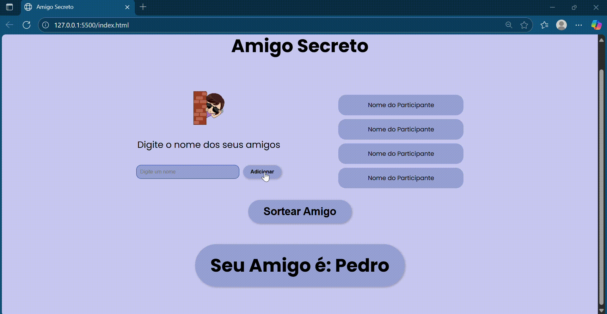
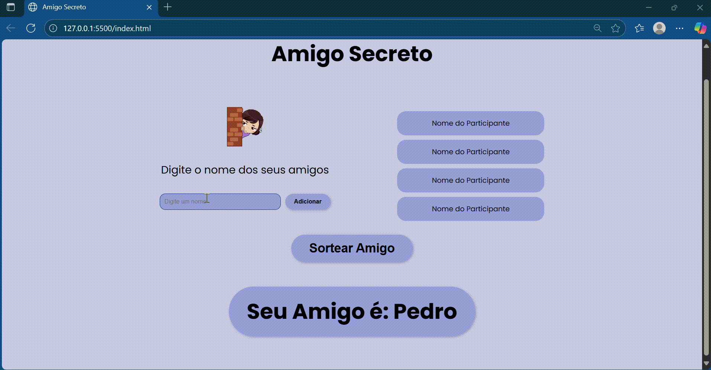

# Amigo Secreto

Um projeto simples para sortear amigos secretos de forma rápida e divertida.

### Sobre o Projeto
Este é um aplicativo web para auxiliar no sorteio de Amigo Secreto entre amigos e familiares. O usuário digita os nomes dos participantes, e o sistema faz o sorteio de forma aleatória, garantindo que ninguém tire a si mesmo.

### Tecnologias Utilizadas
- **HTML5:** Para a estrutura da página.
- **CSS3:** Para a estilização e o visual.
- **JavaScript:** Para a lógica de adicionar, remover e sortear os nomes.

### Como Usar
1.  **Clone o repositório:**
    `git clone https://github.com/CamilaMonteiroRondon/Amigo-Secreto.git`
2.  **Abra o arquivo:**
    Simplesmente abra o arquivo `index.html` no seu navegador web. Não é necessário nenhum servidor ou instalação adicional.

###Demonstração 

### Funcionalidades
- Adicionar nomes de participantes.
- Exibir a lista de nomes adicionados.
- Sortear o Amigo Secreto entre os participantes.
- Não permite que uma pessoa tire a si mesma.
- Alerta caso não haja nomes suficientes para o sorteio.

### Autor
- Camila Monteiro Rondon
- [GitHub](https://github.com/CamilaMonteiroRondon) 

